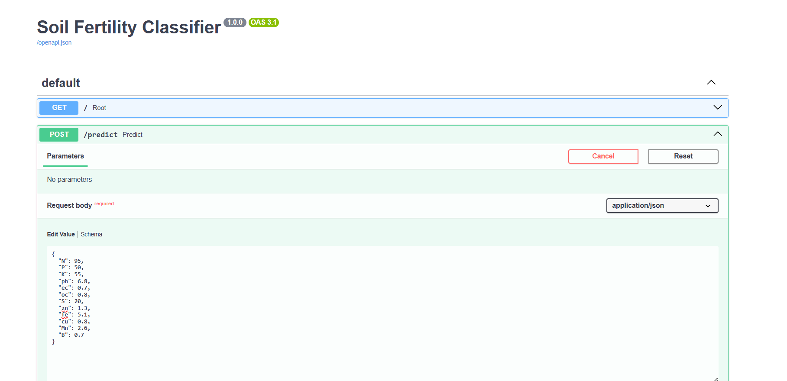
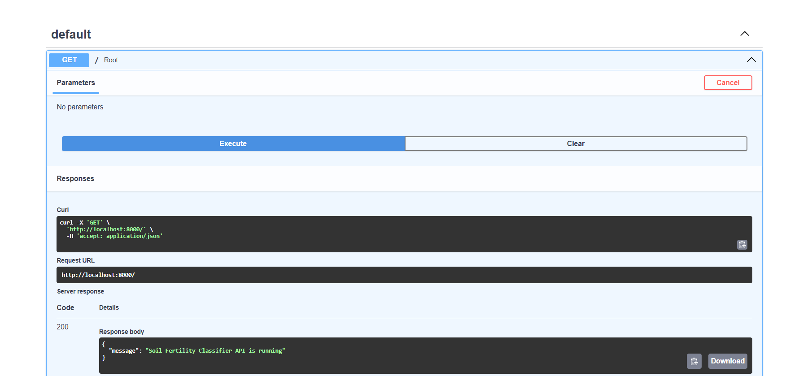
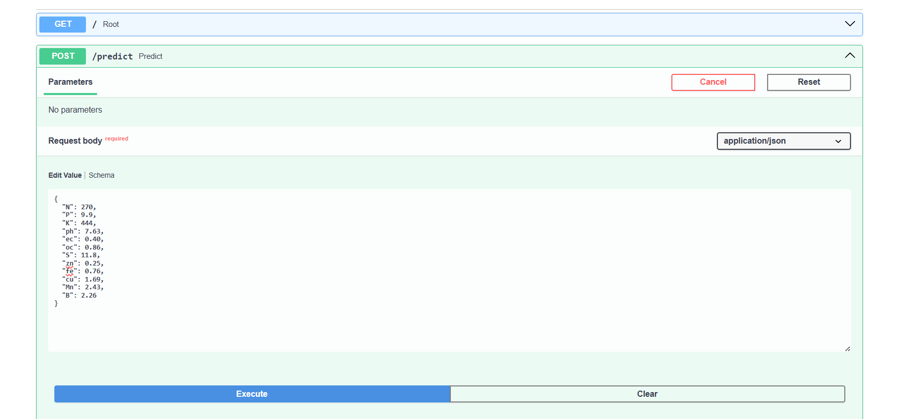
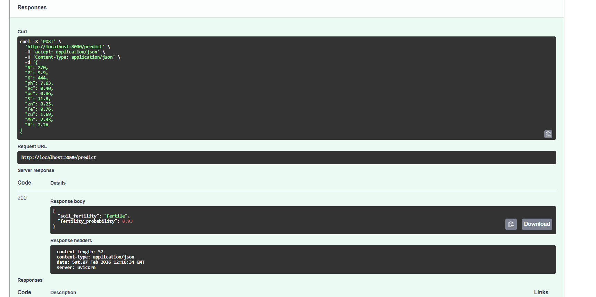
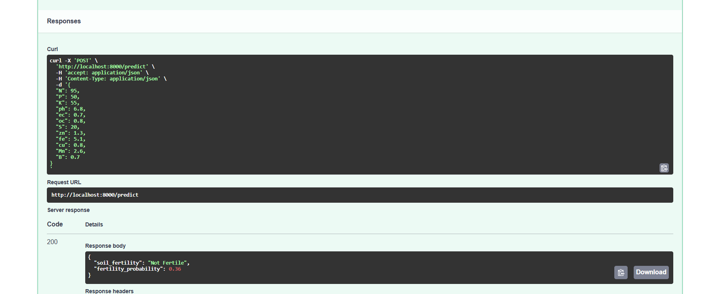
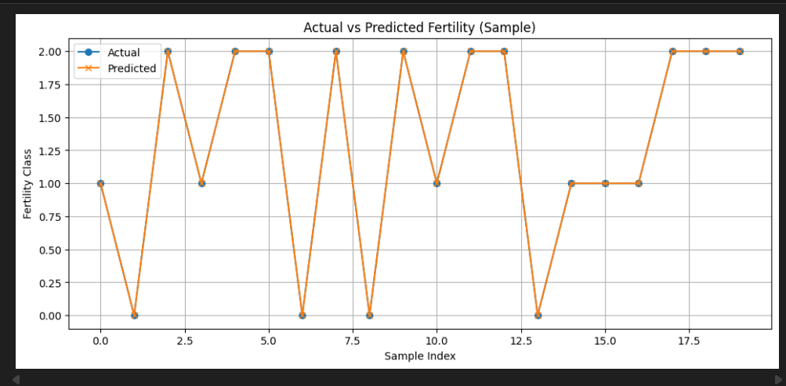
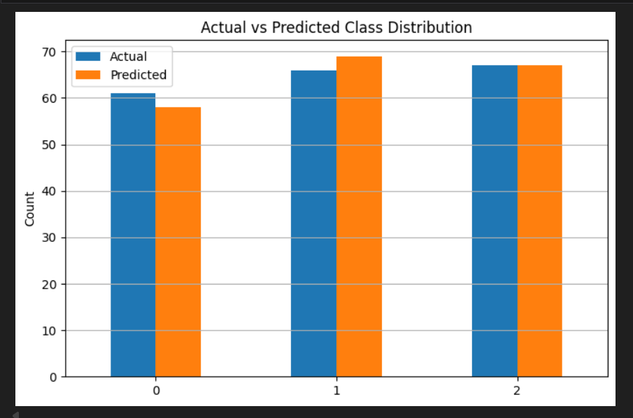
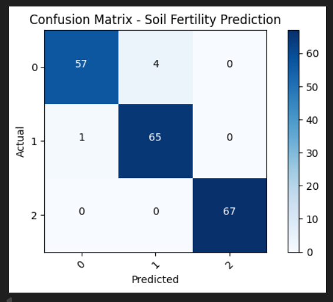
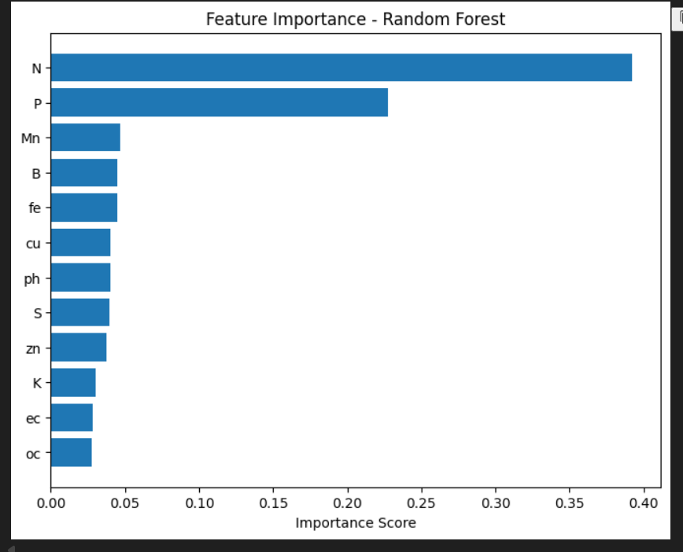

## 📸 Project Interface & API Screenshots

This section demonstrates the **actual working interface** of the Soil Fertility Classifier API using **Swagger UI**, including real inputs and predictions for different soil conditions.

---

### 🏠 API Home / Root Endpoint

The root endpoint confirms that the FastAPI server is running successfully.

**Endpoint:** `GET /`

---

### 🔍 GET Root Endpoint – Swagger UI Execution

Execution of the root endpoint directly from Swagger UI.

---

### 🌱 Fertile Soil – Input Parameters

JSON input values submitted to the `/predict` endpoint for a soil sample classified as **Fertile**.

This includes macronutrients, micronutrients, pH, EC, and OC values entered through Swagger UI.

---

### ✅ Fertile Soil – Prediction Result

Prediction output returned by the model for the fertile soil input, showing high confidence.

---

### 🚫 Not Fertile Soil – Prediction Result

Prediction output for a soil sample classified as **Not Fertile**, demonstrating the model’s ability to distinguish soil quality accurately.

---

> All screenshots are taken directly from the live Swagger UI of the Soil Fertility Classifier FastAPI application.

## 📊 Model Performance & Evaluation Visualizations

This section highlights the **performance and reliability** of the Random Forest model used for soil fertility classification.  
All visualizations are generated after model training and evaluation.

---

### 📈 Actual vs Predicted Fertility (Sample)

This plot compares the **actual soil fertility classes** with the **model’s predicted classes** across sample inputs, showing prediction accuracy and consistency.

---

### 📊 Class Distribution (Actual vs Predicted)

This bar chart compares the **distribution of fertility classes** in the test dataset versus the model predictions, indicating balanced learning and minimal bias.

---

### 🧮 Confusion Matrix – Soil Fertility Prediction

The confusion matrix provides a detailed breakdown of **correct and incorrect classifications** for each fertility class.

---

### 🌾 Feature Importance – Random Forest Model

This visualization shows the **relative importance of soil parameters** (N, P, K, pH, EC, micronutrients, etc.) used by the Random Forest model during prediction.

---

> These evaluation results confirm that the model generalizes well and identifies key soil features influencing fertility classification.

## 🏗️ System Architecture & Workflow

This section explains how the complete system works — from user input to model prediction — in a clear end-to-end flow.

---

### 🔄 End-to-End Workflow

1. User opens the **Swagger UI** interface  
2. Soil nutrient values are entered in JSON format  
3. Request is sent to the **FastAPI backend**  
4. Backend loads the trained **Random Forest model**  
5. Model performs inference on the input data  
6. API returns:
   - Soil fertility status
   - Prediction confidence score  

---

### 🧠 Architecture Overview

User / Client (Swagger UI, Postman)
↓
FastAPI REST API
↓
Random Forest ML Model
↓
Fertility Prediction (JSON)

---

### 🛠️ Technology Stack

- **Programming Language:** Python  
- **Machine Learning:** Scikit-learn (Random Forest Classifier)  
- **Backend Framework:** FastAPI  
- **Data Validation:** Pydantic  
- **Model Serialization:** Pickle  
- **API Testing:** Swagger UI  
- **Containerization:** Docker  

---

### ✅ Key Design Decisions

- Used **Random Forest** for robustness on tabular soil data  
- FastAPI chosen for **high performance and automatic docs**  
- Pydantic ensures **strict input validation**  
- Docker enables **portable and reproducible deployment**

---

> This modular architecture allows easy scaling, deployment, and future enhancements such as monitoring or retraining pipelines.
## 🐳 Dockerization & Deployment

This project is fully containerized using **Docker**, ensuring consistent behavior across local development and production environments.

---

### 🐳 Docker Overview

- The FastAPI application is packaged into a Docker image
- All dependencies are installed via `requirements.txt`
- The trained Random Forest model is bundled inside the container
- Uvicorn is used as the ASGI server

This allows the API to run identically on any system that supports Docker.

---

### 📦 Docker Build

Build the Docker image using the following command:

bash
docker build -t soil-fertility-api .

Run Docker Container

Run the container and expose the API on port 8000:

docker run -p 8000:8000 soil-fertility-api

Once running, the API will be available at:

http://localhost:8000

Swagger UI (for testing):
http://localhost:8000/docs

